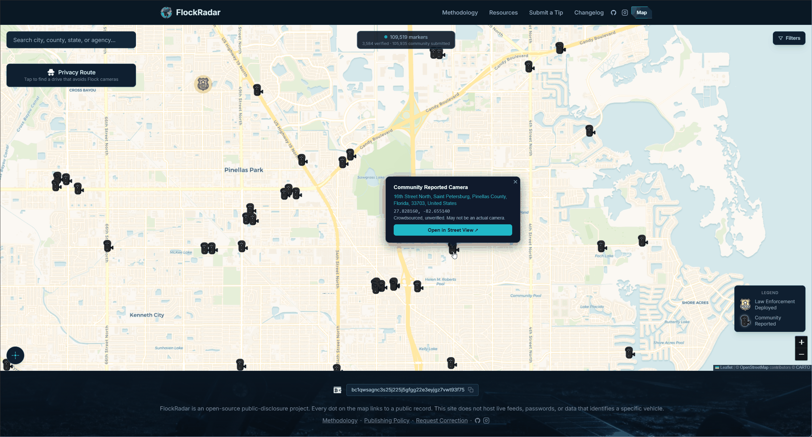

<div align="center">

# FlockRadar 


**The public map of license plate reader cameras your government has already told you about.**

[](LICENSE)
[](#)
[](https://nextjs.org)

[](https://www.instagram.com/flockradar)

[flockradar.com](https://flockradar.com) · [The Map](https://flockradar.com/map) · [Methodology](https://flockradar.com/methodology) · [Donate](#support-the-work)

</div>

---
> **What this is:** a read-only transparency site. It runs nothing on your machine, asks for no account, and tracks no visitors.

> **What it hosts:** only records governments published. No live camera feeds, no plate data, no personal information.

> **How to read it:** every point links to the public record behind it. No record found means the government has not said anything yet, not that cameras are absent.

---

## The Problem

License plate reader cameras photograph every car that passes, along with the time and place. Police agencies, counties, school districts, and HOAs install them, often through contracts that never get a public hearing. The records show where you live, where you work, where you go to church or the doctor. Most people never learn their town has them until a story breaks.

Other projects track these cameras. DeFlock and the EFF Atlas of Surveillance do important work, and their community-reported data is a good starting point. FlockRadar takes a narrower path: **every point on this map traces to a specific public record you can open yourself.** Nothing is published from a sighting or a rumor alone. When the evidence is thin, the map says so.

## See It Work



The live feed and stats are real endpoints. Try them:

```bash
# live deployment stats
curl -s https://flockradar.com/api/stats | jq

# the ALPR news reel, fresh from Google News
curl -s https://flockradar.com/api/feed | jq '.items | length'
```

## Get Started

**You do not need an account.** Three things anyone can do:

1. **Look around:** open [the map](https://flockradar.com/map). Green dots are confirmed deployments; amber markers flag records that need a closer look. Every popup links to its source.
2. **Learn the basics:** the [homepage](https://flockradar.com) explains how these cameras work, how they get used, and the documented abuse cases. The [methodology](https://flockradar.com/methodology) shows exactly how records are verified.
3. **Add or fix something:** found a public record about a new deployment? [Submit a tip](https://flockradar.com/submit). See an error? [Request a correction](https://flockradar.com/correct). Both go through human review, never straight to the map.

<details>
<summary><b>Run it locally</b></summary>

```bash
git clone https://github.com/rxsklife/flockradar.git
cd flockradar
npm install
cp .env.local.example .env.local   # add your Postgres connection string
npm run db:migrate
npm run dev                        # http://localhost:3000
```

The stack: Next.js 16, React 19, Tailwind 4, Drizzle + Postgres (PostGIS), Leaflet. The map page loads 3,584 entity records from a PostGIS database; the live feed aggregates Google News server-side with no API key.

</details>

## How It Works

FlockRadar is a public-source project. Records come from council agendas, contracts, policies, budgets, meeting minutes, official announcements, and records-request responses. Each record gets a precision level (exact location, intersection, neighborhood, or jurisdiction), a confidence score, and a status: confirmed active, approved and pending, proposed, previously deployed, or removed.

<details>
<summary><b>Evidence hierarchy</b></summary>

1. Official contract, agenda, policy, budget, or meeting minutes.
2. Official city, county, or agency announcement.
3. A public records request response we are allowed to publish.
4. Local news reporting that names the agency.
5. Vendor material. Useful as a lead; we confirm it on our own.
6. Community tips. Never enough on their own for a confirmed label.

</details>

<details>
<summary><b>The review pipeline</b></summary>

Tips and corrections land in a pending queue, get reviewed by a human, and only then reach the map. Every approved change writes a public changelog entry. The changelog, the data model, and the research rules live in this repository, so the whole process is open to inspection.

</details>

## Support the Work

FlockRadar is free, open source, ad-free, and tracker-free. It runs on donations and spare evenings. If the map helped you understand what is watching your town, consider a one-time contribution:
```
bc1qwsagnc3s25j225j5gfgg22e3eyjgz7vwt93f75
```

## FAQ

**Is this a sighting map?** No. FlockRadar publishes only what governments have disclosed. Community reports are welcome as leads, but they never appear on the map until a public record backs them.

**Where does the data come from?** Public records: contracts, council agendas, policies, budgets, meeting minutes, announcements, and records-request responses.

**A camera near me is missing from the map.** Tell us. If a public record exists, the [tip form](https://flockradar.com/submit) is the fastest way to get it reviewed.

## Contributing

Contributions are welcome: data, research, code, and design. See [CONTRIBUTING.md](CONTRIBUTING.md) for the workflow, and the [methodology](https://flockradar.com/methodology) for what counts as evidence.

## License

[AGPL-3.0](LICENSE). This project maps surveillance infrastructure; the AGPL keeps every fork, commercial or not, under the same open terms.
